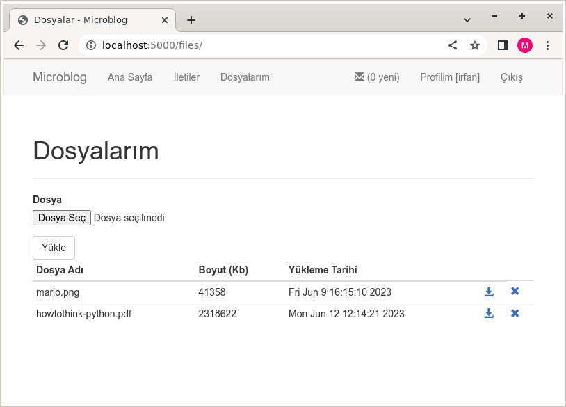
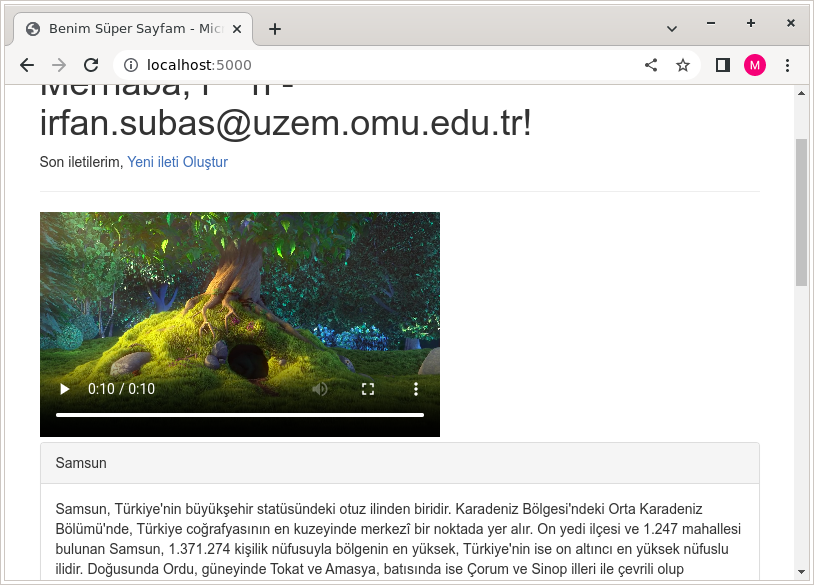

# Ek Ders

## Dosyaları görüntüleme

Dosyaların oluşturma zamanın görüntüleyeceğiz, ancak `Path()` Unix zamanı olarak döndürdüğünden bunu unix ctime veya istediğiniz bir formata dönüştürmek
için `get_time` filteresini yazalım. `microblog/application.py` dosyasını açın, başa `import time` ekleyin, `create_app()` fonksiyonunun en altına aşağıdaki filtereyi yazın:

```
    @app.template_filter()
    def get_time(timestamp):
        return time.ctime(timestamp)
```

`microblog/views/files.py` dosyasının başına `from pathlib import Path` ekleyin, ve `index()` fonksiyonuna `return` den önce:

`user_files_path = Path(current_user.upload_dir)`

ekleyin ve bunu template gönderin:

`return render_template('files/index.html', title=title, form=form, user_files_path=user_files_path)`

`microblog/microblog/views/files/index.html` dosyasına `endblock`dan önce aşağıdaki satırları ekleyin:

```
  <table class="table table-condensed">
  <thead><th>Dosya Adı</th><th>Boyut (Kb)</th><th>Yükleme Tarihi</th><th></th></thead>

  
    <tr>
      <td>{{ file_path.relative_to(current_user.upload_dir) }}</td>
      <td>{{ file_path.stat().st_size}}</td>
      <td>{{ file_path.stat().st_mtime | get_time }}</td>
      <td><a href="#"><span class="glyphicon glyphicon-download-alt"></span></a></td>
    </tr>
  

  </table>
```

İndirme ve silme linkini daha sonra yazacağız.

Şimdi tarayıcıda şu şekilde görünecektir. 



### İndirme linki
Önce `microblog/views/files.py` dosyasında `flask` modülünden şu nedneleri içerelim `send_from_directory, redirect, url_for`:

```
from flask import Blueprint, render_template, request, current_app, flash,\
    send_from_directory, redirect, url_for
```

Bu dosyaya aşağıdaki fonksiyonu yazalım:

```
@files_bp.route('/download/<filename>')
@login_required
def download(filename):
    if os.path.exists(os.path.join(current_user.upload_dir, filename)):
        return send_from_directory(current_user.upload_dir, filename)
    else:
        flash("Böyle bir dosya yok")
        return redirect(url_for('files.index'))
```
`microblog/microblog/views/files/index.html` dosyasında indirme linkini aşağıdaki gibi düzenleyelim:

`<a href="{{url_for('files.download', filename=file_path.relative_to(current_user.upload_dir))}}"><span class="glyphicon glyphicon-download-alt"></span></a>`

### Silme linki

`microblog/views/files.py` dosyasına aşağıdaki fonksiyonu ekleyelim:

```
@files_bp.route('/delete/<filename>')
@login_required
def delete(filename):
    file_path = os.path.join(current_user.upload_dir, filename)
    if os.path.exists(file_path):
        os.remove(file_path)
    else:
        flash("Böyle bir dosya yok")
    return redirect(url_for('files.index'))
```

`microblog/microblog/views/files/index.html` dosyasında silme linkini aşağıdaki gibi düzenleyelim:

`<a href="{{url_for('files.delete', filename=file_path.relative_to(current_user.upload_dir))}}"><span class="glyphicon glyphicon-download-alt"></span></a>`

Aslında silmeden önce javascript ile silinmesinden emin olup olmadığını sormak gerekir. Bunu yapabilirmisiniz?

## Video Oynatma

flask static dosyaları `static` klasöründen tarayıcıya gönderir. Bu klasöre şu dosyayı kaydedelim `Big_Buck_Bunny.mp4` (https://test-videos.co.uk/vids/bigbuckbunny/mp4/h264/1080/Big_Buck_Bunny_1080_10s_5MB.mp4)

Bu videoyu `microblog/templates/index/index.html` dosyasında aşağıdaki gibi gösterebiliriz:

```
<video width="400" controls>
  <source src="static/Big_Buck_Bunny.mp4" type="video/mp4">
  Tarayıcınız video göstermeyi desteklemiyor
</video>
```

Anasayfa aşağıdaki gibi görünmelidir:


